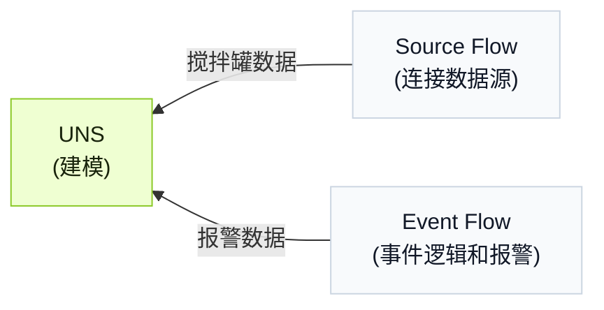

import { Steps } from '@astrojs/starlight/components';
import { Tabs, TabItem } from '@astrojs/starlight/components';

Tier0 在 UNS 模型侧提供 agent，让你可以通过自然语言操作 UNS 和 flow。

:::note[为什么需要 UNS agent]
你不需要在不同模块之间来回切换，并一步步完成数据建模、数据连接和事件构建；UNS agent 可以通过对话完成这些工作。
:::

## Workflow 背景
:::note
这里用一个示例 workflow 来展示使用 agent 完成工作的简洁方式。
:::
搅拌罐用于在加热过程中混合物料。你需要构建数据模型，并采集温度、液位和加热器状态，用于判断搅拌罐是否过热并触发报警。

<div className="t0-compact-mermaid">



</div>

## 如何构建 Workflow？
<Steps>
1. 登录 Tier0，进入 **UNS**，并在右侧与 UNS agent 开始对话。
2. 将对话权限切换为 `full_access`，然后输入 prompt。
    ```text
    创建一个数据模型，用于表示搅拌罐的温度、液位和加热器状态。温度和液位放在一个 metric topic 中，加热器状态放在一个 state topic 中。
    ```
3. 确认模型完成后，输入 prompt，让 agent 将对应数据连接到模型。
    ```text
    创建一个 source flow，向这 2 个 topic 发送数据，并模拟合理数据。
    ```
    :::tip[当你有真实数据源时]
    告诉 agent 你的数据源信息，并让它完成连接。
    :::
4. 输入 prompt，按照下面的逻辑创建一个 event。
    - 低液位 warning：当液位低于 20% 且加热器开启时触发。
    - 干烧 alarm：当液位低于 15%、温度高于 90°C 且加热器开启时触发。
    ```md
    根据以下报警逻辑创建一个 Event Flow：
      - Warning：当 level < 20 且 heater_status = true 时触发。
      - Critical：当 level < 15、temperature > 90 且 heater_status = true 时触发。
      - 当 level > 25 或 heater_status = false 时清除当前报警。
    在现有 source path 下创建一个新 topic 接收报警结果。输出中包含报警级别、消息、激活状态和时间戳。
    ```
5. 在 **UNS** 中查看结果。
</Steps>

