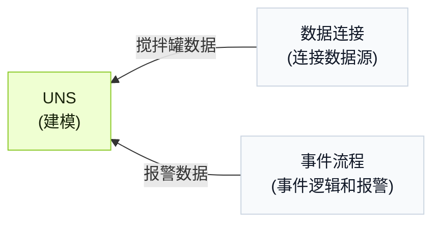

import { Steps } from '@astrojs/starlight/components';
import { Tabs, TabItem } from '@astrojs/starlight/components';

Tier0 支持使用 UNS agent 通过自然语言操作 UNS 模型和数据流。

:::note[为什么需要 UNS agent]
没有 UNS agent，你要在不同模块之间来回切换，才能一步步完成数据建模、数据连接和事件构建；有 UNS agent，你可以通过跟它对话，让它帮你完成。
:::

## 工作流背景
:::note
这里用一个示例工作流来展示使用 UNS agent 完成工作的简洁方式。
:::
搅拌罐用于在加热过程中混合物料。为了判断搅拌罐是否过热，你需要构建数据模型，并采集温度、液位和加热器状态，并在异常情况发生时触发报警。

<div className="t0-compact-mermaid">


```mermaid
flowchart RL
  source["数据连接<br/>(连接数据源)"]
  event["事件流程<br/>(事件逻辑和报警)"]
  uns["UNS<br/>(建模)"]

  source -->|"搅拌罐数据"| uns
  event -->|"报警数据"| uns

  classDef t0accent fill:#EFFFD2,stroke:#8AC926,stroke-width:1px,color:#18230B
  classDef t0node fill:#F8FAFC,stroke:#CBD5E1,stroke-width:1px,color:#111827
  class uns t0accent
  class source,event t0node
```

</div>

## 如何构建工作流？
<Steps>
1. 登录 Tier0，进入 **UNS**，并在右侧与 UNS agent 开始对话。
2. 将对话权限切换为 `full_access`，然后输入 prompt。
    ```text
    创建一个数据模型，用于表示搅拌罐的温度、液位和加热器状态。温度和液位放在一个 metric topic 中，加热器状态放在一个 state topic 中。
    ```
3. 确认模型完成后，输入 prompt，让 agent 将对应数据连接到模型。
    ```text
    创建一个数据连接，向这 2 个 topic 发送数据，并模拟合理数据。
    ```

    :::tip[当你有真实数据源时]
    告诉 agent 你的数据源信息，并让它完成连接。
    :::

4. 输入 prompt，按照下面的逻辑创建一个事件。
    - 低液位预警：当液位低于 20% 且加热器开启时触发。
    - 干烧报警：当液位低于 15%、温度高于 90°C 且加热器开启时触发。
    ```md
    根据以下报警逻辑创建一个事件流程：
      - 警告：当 level < 20 且 heater_status = true 时触发。
      - 严重：当 level < 15、temperature > 90 且 heater_status = true 时触发。
      - 当 level > 25 或 heater_status = false 时清除当前报警。
    在现有 UNS 模型下创建一个新 topic 接收报警结果。输出中包含报警级别、消息、激活状态和时间戳。
    ```
5. 在 **UNS** 中查看结果。
</Steps>

