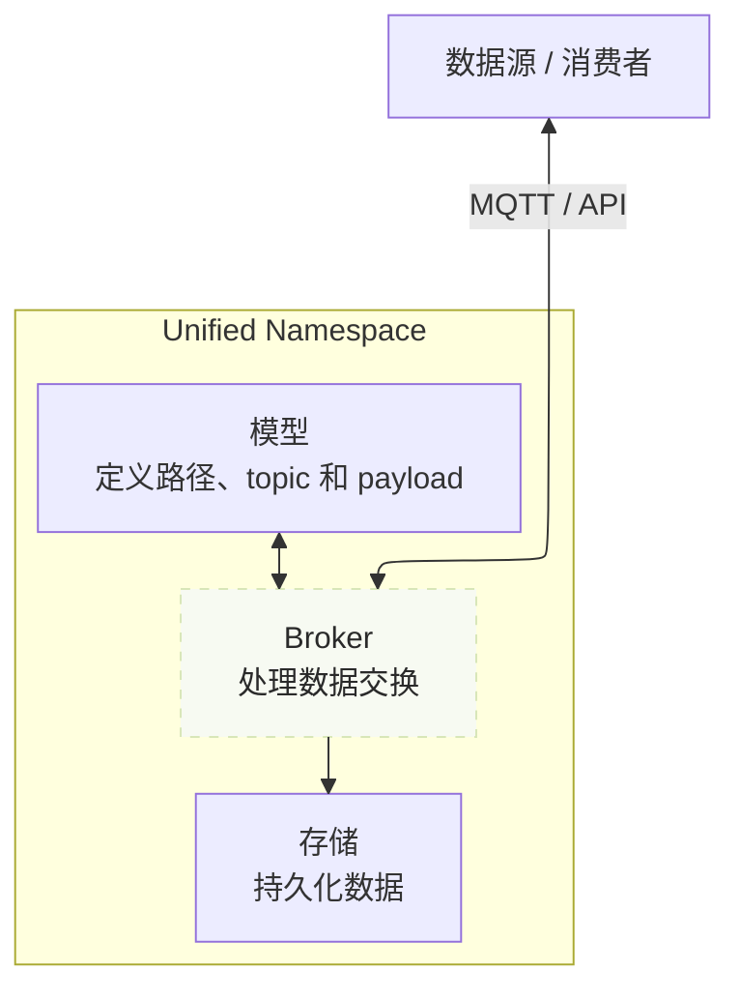
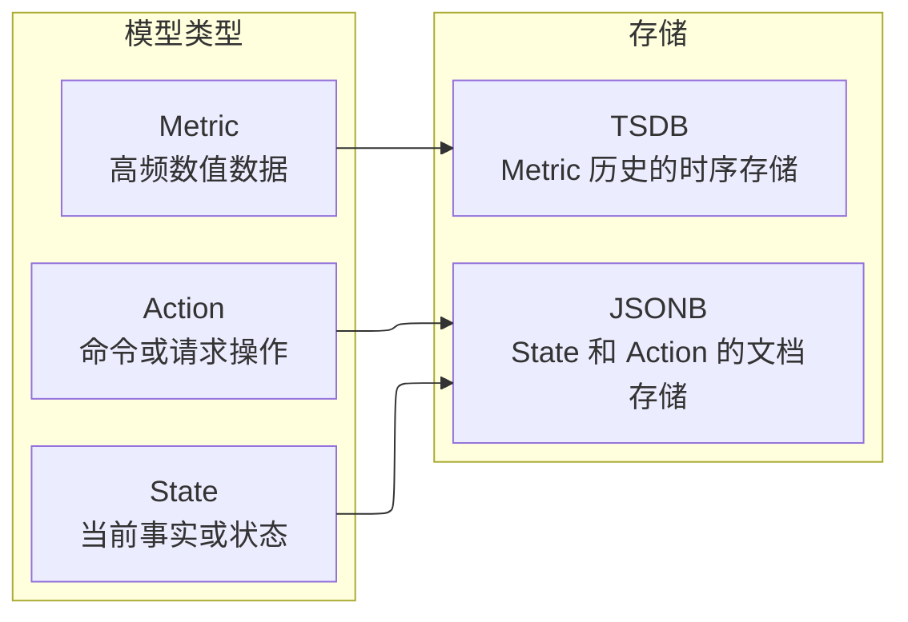

import { Tabs, TabItem } from '@astrojs/starlight/components';


在 Tier0 中，工厂数据会基于 UNS（Unified Namespace）方法组织成清晰的树形模型，形成统一的数据基础。
- Broker 通过模型 topic 接收和发送数据。

<div className="t0-uns-foundation-mermaid t0-uns-foundation-mermaid--flow">

</div>
- 模型分为 **Metric**、**State** 和 **Action** 三种类型。
- 数据会根据模型类型存储到不同数据库中。
    - **Action/State**: JSONB (PostgreSQL)
    - **Metric**: 实时数据（TSDB）

<div className="t0-uns-foundation-mermaid t0-uns-foundation-mermaid--types">

</div>
## 模型
:::tip[建模时应该参考哪种方式？]
根据数据代表的对象选择建模方式。
- **物理数据**：来自物理设备的实时数据。它通常基于 **ISA-95** 标准组织，并强依赖位置层级。
- **业务数据**：与生产需求、计划、任务和调度相关的数据。它通常按 **业务域和对象** 组织。
:::
### Metric、State、Action
工业数据变化频率不同，目的也不同，因此 Tier0 将 UNS 模型固定分为三类。

| 类型 | 对象 | 示例 |
|---|---|---|
| `METRIC` | 面向连续采集、需要时序存储的高频数据。 | 设备温度/压力/电压 |
| `STATE` | 面向变化频率较低、用于描述对象当前状态或事实的数据。 | 设备运行状态 |
| `ACTION` | 面向低频命令数据，用于记录外部系统或操作员应执行的动作。 | 启动批次、停止设备 |

### Path/Topic、消息内容
每个 UNS 模型都包含 path、topic 和消息内容。它们共同形成一棵**树**，既承载业务上下文，也传输工业数据。
- **Path/Topic**：path 表示数据归属，topic 承载消息内容。二者共同定义 ***模型地址***。
- **消息内容**：topic 中保存的消息内容。它是 **键值对** 格式的 JSON，用来定义 ***模型数据***。

例如，UNS 中的模型可以像下面这样表示：
<Tabs>
	<TabItem label="物理数据">
```text
  Factory_A
  └── Site_01
      └── SMT_Line_1
          └── Metric
              └── Machine_001
```
- **Path**：`Factory_A/Site_01/SMT_Line_1/Metric`
- **Topic**：`/Machine_001`。
- **消息内容**
    ```json
    "temperature": 85,
    "vibration": 2.8,

    ```
</TabItem>
<TabItem label="业务数据">
```text
  Factory_A
  └── ERP
      └── ProductionOrders
          └── State
              └── OrderList
```
- **Path**：`Factory_A/ERP/ProductionOrders/State`
- **Topic**：`/OrderList`。
- **消息内容**
    ```json
    "orders": "0123569876",
    "updated_at": 2026-7-13,
    ```
</TabItem>
</Tabs>

:::tip[构建模型]
参见 [如何构建数据模型](../connect-data/#构建数据模型)。
:::

## Broker
在 Tier0 中，broker 是平台组件，它会基于数据模型，通过 MQTT 或 OpenAPI 接收和发送数据。
- **通过 MQTT**：模型树中每个节点的完整路径会作为 topic 地址，用于传递消息内容。
- **通过 Open API**：通过 HTTP 请求对数据模型执行 CRUD 操作。
:::tip[API 文档]
API 详情见 [API 文档](../../reference/tier0-openapi/)。
:::

## Storage
Tier0 使用 PostgreSQL 存储数据。不同数据类型变化频率不同，也有不同的存储要求。

| 数据类型 | 存储 | 说明 |
|-----------|---------|-------------|
| Metric | TSDB | 针对温度、压力等高频测量数据优化。每个 topic 默认包含 `timestamp` 和 `quality` 字段。 |
| State | PostgreSQL | 以灵活的 `JSONB` 格式存储设备或系统状态。 |
| Action | PostgreSQL | 以灵活的 `JSONB` 格式存储命令或动作。 |

## 下一步

- [连接数据到 UNS](../connect-data/) - 如何将工厂建模到 UNS，并把数据连接到模型。
- [使用 UNS 数据](../working-with-uns-data/) - 如何通过 MQTT 和 API 操作你的 UNS 模型。
